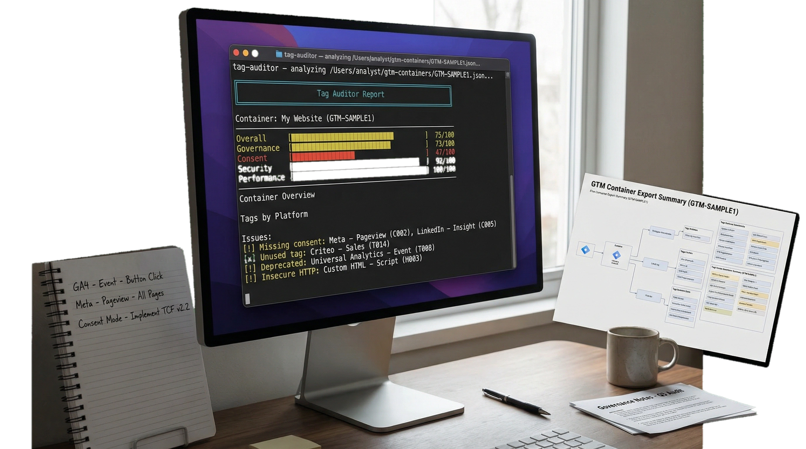
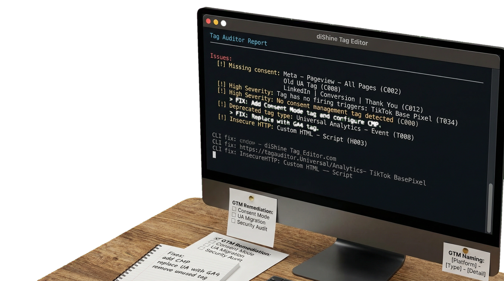
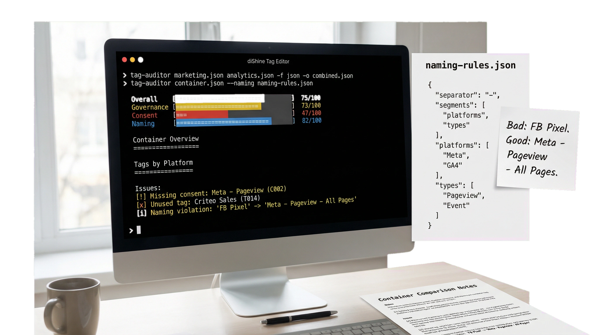

# 🛡️ TAG Auditor: easily audit containers on 17 checks across governance, consent, security, performance, and naming.

<div align="center">
  
[](https://dishine.it/)

***Transform. Automate. Shine!***

[](https://dishine.it/)
[](https://linkedin.com/company/100682596)
[]()
[](LICENSE)

<p align="center">
  
</p>

***TAG Auditor reads a GTM container JSON export and runs 17 checks across governance, consent, security, performance, and naming. It produces scores (0–100) in four areas and a list of issues sorted by severity, each with a specific fix.
No external dependencies. No network requests. It parses JSON locally.***

Built by [diShine Digital Agency](https://dishine.it).

</div>

<p align="center">
  
  
</p>

---

## Quick start

```bash
npm install -g @dishine/tag-auditor

tag-auditor container.json
```

Or run without installing:

```bash
npx @dishine/tag-auditor container.json
```

### More examples

```bash
# Save a Markdown report
tag-auditor container.json -f markdown -o report.md

# Show only high and critical issues
tag-auditor container.json -s high

# Enforce custom naming conventions
tag-auditor container.json --naming naming-rules.json

# Audit multiple containers
tag-auditor marketing.json analytics.json -f json -o combined.json
```

---

## Getting your GTM container export

1. Open [tagmanager.google.com](https://tagmanager.google.com)
2. Select your container
3. Go to **Admin** → **Export Container**
4. Choose a version or workspace
5. Save the `.json` file
6. Run: `tag-auditor exported-file.json`

You need at least **Read** access to the GTM container. See the [User Guide](GUIDE.md) for details.

---

## Example output

```
  Tag Auditor Report
  Container: My Website (GTM-XXXXX)

  Scores
  Overall:      [###############     ] 72/100
  Governance:   [################    ] 81/100
  Consent:      [############        ] 55/100
  Security:     [####################] 100/100
  Performance:  [##################  ] 89/100

  Issues (8)
  2 critical  |  2 high  |  3 medium  |  1 low

   CRITICAL  [consent] No consent configuration: "Meta - Pageview"
   HIGH      [unused] Tag has no firing triggers: "GA4 - Event - Old Click"
   MEDIUM    [naming] Inconsistent naming convention
```

---

## Audit checks

| # | Check | Category | What it finds |
|---|-------|----------|---------------|
| 1 | Unused tags | unused | Tags with no triggers — they never fire |
| 2 | Unused triggers | unused | Triggers not attached to any tag |
| 3 | Unused variables | unused | Variables not referenced anywhere |
| 4 | Duplicate tags | duplicates | Same type + configuration (risk of double-counting) |
| 5 | Paused tags | governance | Disabled tags still in the container |
| 6 | Consent configuration | consent | Tracking tags without GDPR consent settings |
| 7 | Consent management | consent | No CMP detected (Consent Mode v2) |
| 8 | Custom HTML security | security | Dangerous patterns (`document.write`, `eval`), insecure HTTP scripts |
| 9 | Performance | performance | Too many tags, large custom HTML, All Pages overload |
| 10 | Deprecated types | deprecated | Universal Analytics, Classic GA, DoubleClick |
| 11 | Folder organization | governance | No folders, unorganized tags |
| 12 | Schedule issues | governance | Expired campaign schedules |
| 13 | Blocking triggers | governance | No internal traffic filtering |
| 14 | Tag sequencing | configuration | GA4 events firing without a config tag |
| 15 | Conversion Linker | configuration | Google Ads tags without a Conversion Linker tag |
| 16 | Circular dependencies | configuration | Setup/teardown tags referencing each other in a loop |
| 17 | GA4 Measurement ID | configuration | GA4 config tags missing a Measurement ID (G-XXXXXXX) |

Plus naming convention checks (basic heuristics or custom rules).

### Scoring

Each area is scored 0–100:

| Area | What it measures |
|------|-----------------|
| **Governance** | Organization, naming, unused items, paused tags |
| **Consent** | GDPR consent configuration, CMP presence |
| **Security** | Custom HTML risks, insecure scripts |
| **Performance** | Container size, tag count, All Pages load |

### Issue severity

| Level | Examples |
|-------|----------|
| **Critical** | Tracking tags without consent, `eval()` usage |
| **High** | Unused tags, deprecated types, insecure scripts, missing CMP |
| **Medium** | Duplicate tags, naming violations, large custom HTML |
| **Low** | Paused tags, unused triggers/variables, missing folders |

---

## CLI options

| Flag | Description | Default |
|------|-------------|---------|
| `-f, --format` | Output format: `table`, `json`, `markdown`, `csv` | `table` |
| `-o, --output` | Save report to file | stdout |
| `-s, --severity` | Minimum severity: `critical`, `high`, `medium`, `low` | `low` |
| `--naming` | Path to naming convention rules (JSON) | basic checks |
| `-q, --quiet` | Suppress progress messages | off |
| `-h, --help` | Show help | — |
| `-v, --version` | Show version | — |

---

## Custom naming conventions

Create a JSON file with your rules:

```json
{
  "separator": " - ",
  "segments": ["platform", "type", "detail"],
  "platforms": ["GA4", "Meta", "LinkedIn", "Google Ads", "GTM", "Hotjar"],
  "types": ["Event", "Pageview", "Config", "Conversion", "Remarketing"]
}
```

```bash
tag-auditor container.json --naming naming-rules.json
```

Tags that don't follow the convention get flagged:
- `"FB Pixel"` → violation (should be `"Meta - Pageview - All Pages"`)
- `"GA4 - Event - Form Submit"` → passes

---

## Platform detection

tag-auditor identifies tags from these platforms:

| Platform | Detection method |
|----------|-----------------|
| GA4 | `gaawc`, `gaawe`, `googtag` types |
| Universal Analytics | `ua` type (flagged as deprecated) |
| Google Ads | `awct`, conversion/remarketing tags |
| Meta (Facebook) | `fbevt` type, name matching |
| LinkedIn | Type or name matching |
| TikTok | Type or name matching |
| Twitter/X | Type or name matching |
| Pinterest | Type or name matching |
| Microsoft Ads | `uet` type |
| Hotjar | Type or name matching |
| HubSpot | Name matching |
| Custom HTML | `html`, `customhtml` types |

---

## Programmatic usage

```javascript
import { parseContainer, auditContainer, formatMarkdown } from "@dishine/tag-auditor";
import { readFileSync } from "fs";

const raw = JSON.parse(readFileSync("container.json", "utf-8"));
const container = parseContainer(raw);
const audit = auditContainer(container, {
  minSeverity: "medium",
  namingConfig: { separator: " - ", segments: ["platform", "type", "detail"] },
});

console.log(formatMarkdown({ container, audit }));

// Access structured data
console.log(audit.scores);   // { overall, governance, consent, security, performance }
console.log(audit.issues);   // Array of { severity, category, title, detail, fix }
console.log(audit.summary);  // Platform breakdown, issue counts
```

---

## Exit codes

| Code | Meaning |
|------|---------|
| `0` | No critical issues found |
| `1` | Critical issues found |
| `2` | Fatal error (invalid file, no valid input) |

---

## Requirements

- Node.js 18 or later
- No external dependencies

---

## Contributing

See [CONTRIBUTING.md](CONTRIBUTING.md).

## License

MIT — see [LICENSE](LICENSE) for details.

Built by [diShine](https://dishine.it)
